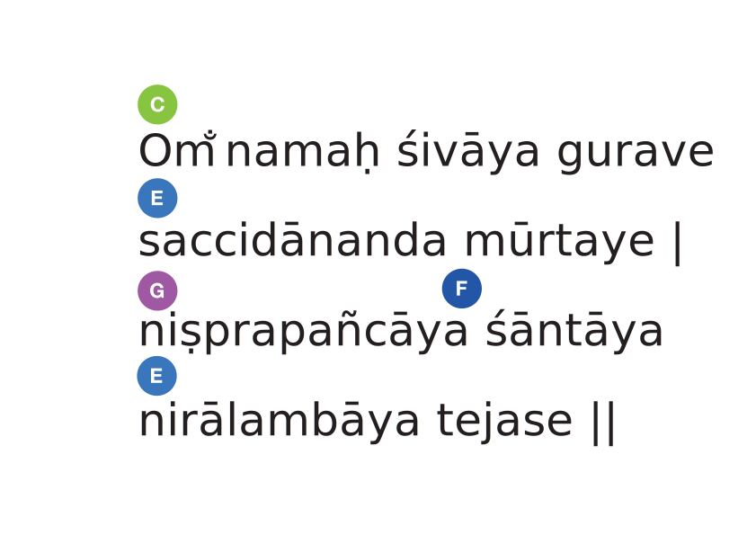

----

ॐ नमः शिवाय गुरवे     
सच्चिदानन्द मूर्तये ।   
निष्प्रपञ्चाय शान्ताय      
निरालम्बाय तेजसे ॥ {sans}

Om̐ namaḥ śivāya gurave  
saccidānanda mūrtaye ।  
niṣprapañcāya śāntāya  
nirālambāya tejase ॥ {trans}

Om. Salutations to the Guru, who is Shiva.
His form (mūrti) is the embodiment (mūrtaye) of Existence-Consciousness-Bliss (saccidānanda).
He is transcendent (niṣprapañca), peaceful (śānta),
free from any support (nirālamba) and radiant (tejas).

----

<audio-player title="Ty burhoe - Angels prayer" file="/audio/Ty-Burhoe-James-Hoskins-Cat-McCarthy-Manorama-and-Janaki-Kagel-Angels-Prayer.mp3" />