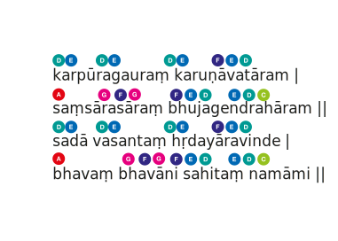

::: stanza

कर्पूरगौरं करुणावतारम् ।  
संसारसारं भुजगेन्द्रहारम् ॥  
सदा वसन्तं हृदयारविन्दे ।  
भवं भवानि सहितं नमामि ॥ {sans}

karpūragauraṃ karuṇāvatāram ।  
saṃsārasāraṃ bhujagendrahāram ॥  
sadā vasantaṃ hṛdayāravinde ।  
bhavaṃ bhavāni sahitaṃ namāmi ॥ {trans}

Camphor-pure and compassion incarnate,  
Essence of existence, adorned with the serpent-king,  
Ever dwelling in the heart's lotus,  
To Bhava with Bhavānī united, I bow.

:::

### Musical Accompaniment

This sublime dhyāna-śloka presents Śiva in his dual aspect as both transcendent consciousness and immanent presence. The camphor imagery (_karpūragaura_) signifies the pure, self-luminous nature of consciousness that burns without residue - consuming all limiting identifications while leaving awareness pristine and radiant.

As _karuṇāvatāra_ (compassion incarnate), Śiva embodies the heart's natural movement toward all existence. The _bhujagendrahāra_ (serpent-king as ornament) represents kuṇḍalinī-śakti, the coiled divine energy that adorns consciousness as its own power of manifestation and recognition.

The verse locates this supreme reality not in distant heavens but in the _hṛdayāravinda_ - the lotus of the heart-center where individual and universal consciousness recognize their non-difference. The final salutation to _Bhava-Bhavānī_ acknowledges the inseparable unity of consciousness (_Śiva_) and its creative power (_Śakti_), the fundamental non-duality at the heart of existence itself.

This ārti transforms devotional practice into direct recognition, where worship becomes the spontaneous celebration of our own essential nature as consciousness-bliss.
