::: stanza

Hindu Guru Nityananda (November/December, 1897 – 8 August 1961) was an Indian guru. His teachings are published in the "Chidakash Gita". Nityananda was born in Koyilandy (Pandalayini), Madras Presidency, British India (now in Kozhikode district, Kerala).

## Biography

### Childhood

Details about Guru Nityananda's birth are relatively unknown. According to his disciples, Nityananda was found as an abandoned infant in Tuneri village, Koyilandy, Madras Presidency, British India by a lady named Uniamma Nair, who was married to Chathu Nair. The Nair couple adopted this child and took care of him along with their own five children. Nityananda was named as Raman by his foster parents. The Nair couple were farmers, who also took care of the farms owned by a wealthy lawyer named Ishwar Iyer, who greatly trusted them. Nityananda's foster father died when he was three and his foster mother when he was six. Before dying she handed over her responsibility of Nityananda to Ishwar Iyer.

## Spiritual life

### Guru Nityananda Samadhi

Even in childhood, Guru Nityananda seemed to be in an unusually advanced spiritual state, which gave rise to the belief that he was born enlightened. He was eventually given the name Nityananda, which means, "always in bliss".

Before the age of twenty, Nityananda became a wandering yogi, spending time on yogic studies and practices in the Himalayas and other places. By 1920, he was back in southern India.

Settled in southern India, Nityananda gained a reputation for performing miracles and curing the sick. He started building an ashram near Kanhangad, Kerala state. The hill temple and Ashram in Kanhangad are now pilgrim centres. The Guruvan, a forest in the hills nearby where Bhagawan sat on penance, is now a pilgrim retreat.

By 1923, Nityananda had wandered to the Tansa Valley in Maharashtra state. There, his reputation as a miracle worker attracted people from as far away as Mumbai, though he never took credit for any miracles. He said, "Everything that happens, happens automatically by the will of God." Nityananda gave a great deal of help to the local adivasis. Nityananda set up a school, where he provided food and clothing for the students.
Guru

As a Guru, GuruNityananda gave relatively little by way of verbal teachings. Starting in the early 1920s, his devotees in Mangalore would sit with him in the evenings. Most of the time he was silent, though occasionally he would give teachings. A female devotee named Tulsiamma (Tulsi Amma) (1882-1945) wrote down some of his teachings and his answers to her specific queries. Later, these notes were compiled and published in the Kannada language and came to be known as the Chidakasha Geeta.

Some believe that Nityananda had the power to transmit spiritual energy (shaktipat) to people through non-verbal means. He could also be extremely fiery and intimidating in his behaviour, even to the point of throwing rocks on occasion. This was his way of deterring people who were not serious in their spiritual aspirations, or who came to him with ulterior motives.

In 1936, he went to the Shiva temple in the village of Ganeshpuri and asked if he could stay there. The family that looked after the temple agreed and built a hut for him. As his visitors and followers increased, the hut expanded and became an ashram. To the people around him, he was an avadhuta: one who is absorbed in the transcendental state.

### Final Years and Death (Samadhi)

Guru Nityananda died on 8 August 1961 at age 63. His samadhi is located in Ganeshpuri at the Samadhi Mandir. There is also a shrine dedicated to him in the Gurudev Siddha Peeth ashram at Ganeshpuri. His ashram, tourist hostel, and other buildings associated with his life in Ganeshpuri are preserved by the Shree Bhimeshwar Sadguru Nityanand Sanstha Ganeshpuri. This trust is also responsible for his samadhi shrine in Ganeshpuri, which is a pilgrimage site.

A trust at Kanhangad looks after the Ashram and temples located there. The trust also runs a few educational institutions and a dharmasala.
Guru Nityananda’s Guru
A life size statue of Guru Nityananda at Bunt Bhavan, Mumbai, India

According to Guru Nityananda's biographers, the identity of Nityananda's guru is a mystery. According to Healy, Nityananda did not have a guru. In one of his talks, his student Swami Muktananda said that Nityananda’s Guru was Swami Sivananda Paramahamsa, an unknown Siddha from Kerala.

[Wikipedia](https://en.wikipedia.org/wiki/Bhagawan_Nityananda)

:::

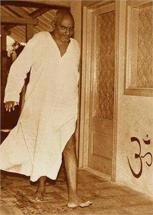
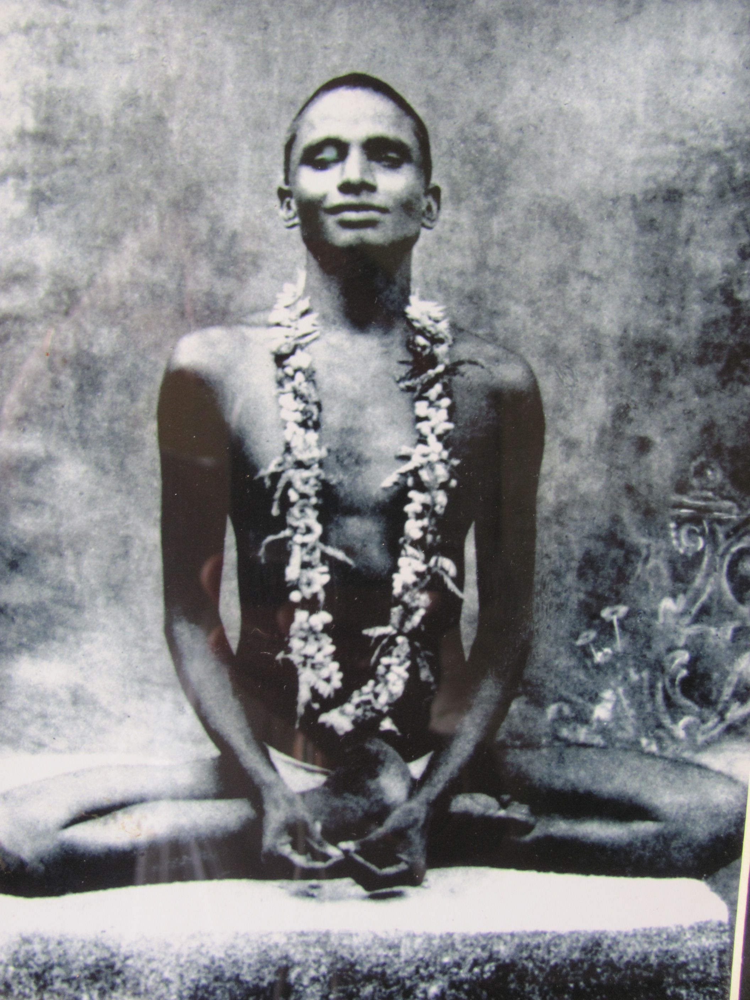
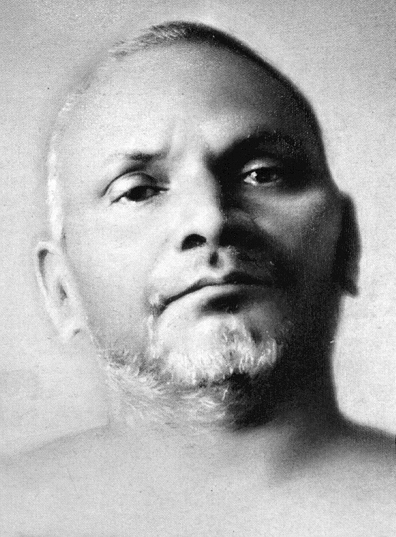

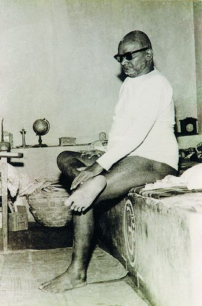

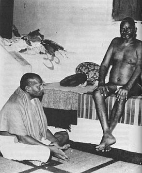
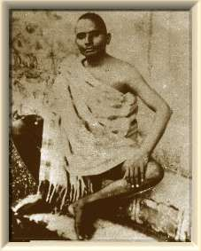

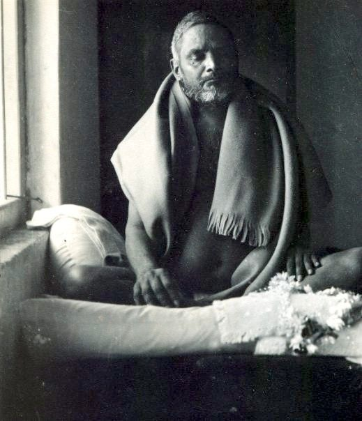

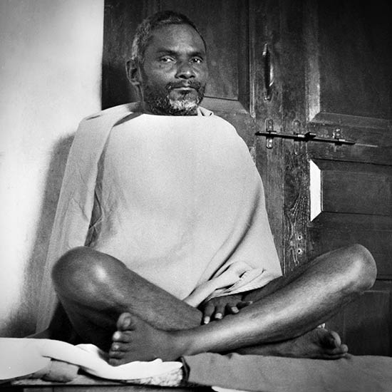
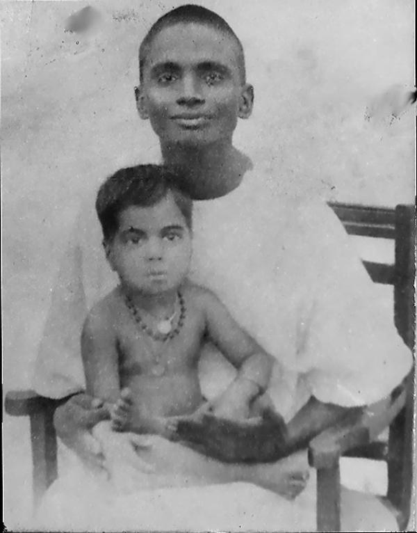

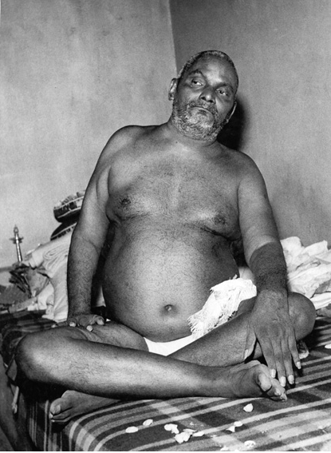

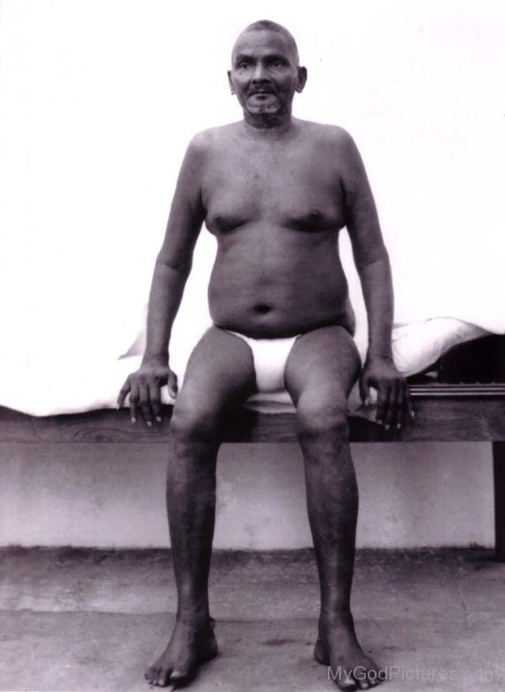

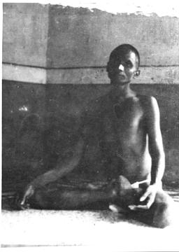
